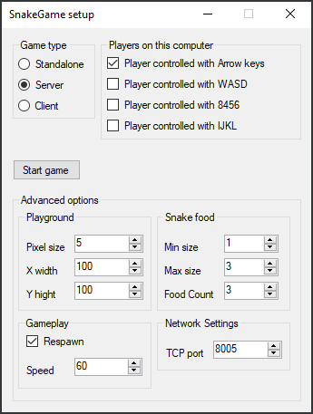
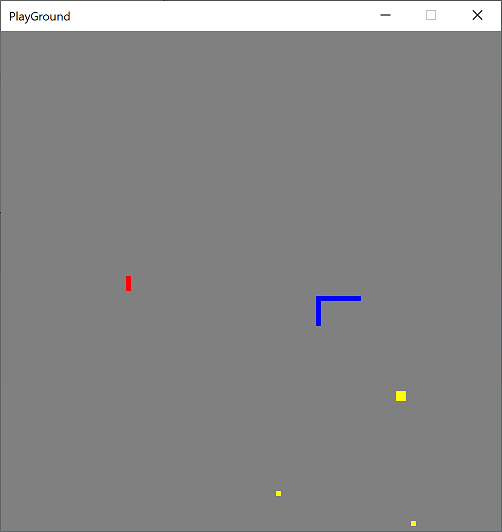

# SnakeGame

Now working in Windows 10!


## Back in in 2007 I wrote ...

```
This is a "classic" snake game with multiplayer support.

The game is written in C#.
I don't know if the game can run in anything other than Windows!

It's my first C# and .net program (besides a couple of Hello World test programs)
so bare with me if it's clumsy use of the libraries or stupid code. 
```

```
This is a "classic" snakegame with multiplayer support.
Copyright (C) 2007  Thor Dreier <thor@dreier.nu>

This program is only tested to compile in Visual Studio 2005.
```

```
Version 1.0.0.0:
Program seems to work ;-)
```


## Screenshots




